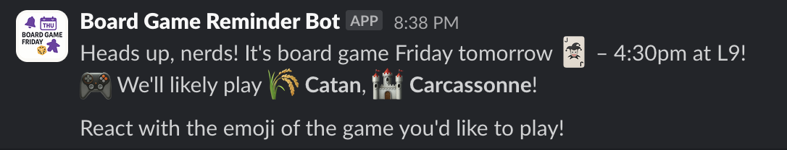

# Building a Slack Bot for Board Game Nights with TypeScript and GitHub Actions

As a software engineer and board game enthusiast, I wanted to solve a common problem in our office: organizing our weekly board game nights. While we had a regular schedule (Friday afternoons), we needed a better way to:
1. Remind people about the upcoming session
2. Suggest games to play
3. Get quick feedback on game preferences

This led me to create a Slack bot that would handle these tasks automatically. In this post, I'll share my journey of building this bot using TypeScript, Slack's Web API, and GitHub Actions.

## The Initial Idea

Every Friday at 4:30 PM, our team gathers for board games. We have quite a collection - from strategic games like Catan to party games like The Resistance. The challenge was getting everyone on the same page about:
- Which games to bring
- Who's interested in playing
- What time to meet

I wanted a bot that would:
- Send fun, casual reminders
- Randomly suggest a few games from our collection
- Let people vote on games using emoji reactions
- Run completely automatically

## Technical Stack

After considering various options, I settled on:
- **TypeScript**: For type safety and better development experience
- **Slack Web API**: For sending messages and handling reactions
- **GitHub Actions**: For scheduling and running the bot
- **Node.js**: For the runtime environment

## Key Features

### 1. Dynamic Message Generation
Instead of sending the same boring message every week, I created a pool of casual, fun messages:

```typescript
const messages = [
  "Heads up, nerds! It's board game Friday tomorrow 🃏 – 4:30pm at L9!",
  "Warning: Friday fun incoming! Join us 4:30pm tomorrow at L9 🎲",
  "Don't make weekend plans – we roll dice tomorrow, 4:30pm L9 😉"
];
```

### 2. Game Configuration
Each game is configured with its name, Slack emoji name, and player count requirements:

```typescript
{
  "games": [
    {
      "name": "Catan",
      "emoji": "rice",      // Slack emoji name for 🌾
      "minPlayers": 3,
      "maxPlayers": 4
    },
    {
      "name": "Carcassonne",
      "emoji": "castle",    // Slack emoji name for 🏰
      "minPlayers": 2,
      "maxPlayers": 5
    }
  ]
}
```

> **Note**: For emojis, we use Slack emoji names (without colons) instead of Unicode emojis. This ensures compatibility with Slack's reaction system. For example, use "rice" instead of 🌾, "castle" instead of 🏰. You can find available emoji names in your Slack workspace by typing `:` in the message input.

### 3. Emoji Reactions
The bot automatically adds emoji reactions for each suggested game, making it easy for people to indicate their preferences:



## Development Process

### 1. Setting Up the Project
I started with a basic Node.js project and added TypeScript:

```bash
npm init
npm install typescript @types/node --save-dev
npm install @slack/web-api dotenv
```

### 2. Configuring Slack
The bot requires several Slack permissions:
- `chat:write`: For sending messages
- `channels:read`: For accessing channels
- `reactions:write`: For adding emoji reactions

### 3. Environment Configuration
I separated the configuration into:
- `.env`: For sensitive data (Slack token)
- `config.json`: For game list and channel settings (production)
- `config.test.json`: For testing configuration (separate channel and settings)

This separation allows us to:
- Keep sensitive data out of version control
- Test new features safely in a separate channel
- Easily switch between production and test environments

### 4. Implementing the Core Logic
The main functionality is in `src/board-game-reminder.ts`:
1. Load configurations
2. Pick random games
3. Send message with game suggestions
4. Add emoji reactions

### 5. Setting Up CI/CD
I used GitHub Actions for:
- Continuous Integration (testing and building)
- Scheduled execution (weekly reminders)
- Automated deployments

## Testing and Iteration

I created a separate test channel (`social-board-games-testing`) to:
- Test message formatting
- Verify emoji reactions
- Check scheduling
- Debug any issues

This proved invaluable for iterating on the bot's functionality without spamming the main channel.

## Deployment and Automation

The bot runs entirely on GitHub Actions, requiring:
1. A GitHub repository
2. Slack Bot Token (stored in GitHub Secrets)
3. Scheduled workflow (runs every Thursday)

## Results and Impact

The bot has successfully:
- Increased participation in game nights
- Made game selection more democratic
- Reduced coordination overhead
- Added a fun element to our weekly reminders

## Future Improvements

Some ideas for future enhancements:
- RSVP functionality
- Game history tracking
- Player count optimization
- Integration with game rules/tutorials

## Try It Yourself

The project is open source and available on GitHub. To set up your own instance:

1. Fork the repository:
   ```bash
   git clone https://github.com/furic/board-game-slack-reminder.git
   ```

2. Create a Slack app and get your bot token

3. Configure your environment:
   - Add your Slack token
   - Customize the game list
   - Set your channel name

4. Deploy and enjoy automated game night coordination!

## Development with Cursor AI

One of the interesting aspects of this project was my experience using Cursor AI as a development partner. What impressed me most was how the AI assistant helped navigate through some tricky implementation details:

### Intelligent API Understanding
I was particularly surprised by how Cursor AI understood the Slack API requirements. When implementing emoji reactions, it correctly identified that we needed to use Slack's emoji format (e.g., "rice" instead of "🌾") rather than Unicode emojis. This saved me from potential runtime issues and demonstrated the AI's practical knowledge of API specifications.

### Step-by-Step Problem Solving
The development process with Cursor AI was methodical and educational:

1. **Initial Implementation**: We started with Unicode emojis in the configuration files, which seemed logical at first.

2. **Problem Identification**: When testing the bot, we encountered `invalid_name` errors with emoji reactions. Cursor AI quickly identified that Slack's API requires emoji names rather than Unicode characters.

3. **Systematic Updates**: The AI guided me through updating multiple files:
   - Changed emoji format in `config.json` and `config.test.json`
   - Updated documentation in README.md
   - Added clear examples and explanations in this blog

4. **Testing and Verification**: After each change, the AI suggested running tests to verify the fixes, showing a practical understanding of development workflows.

### Configuration Management
The AI helped establish a robust configuration system:
```typescript
// Before: Using Unicode emojis
{
  "name": "Catan",
  "emoji": "🌾",  // This caused issues with Slack's API
}

// After: Using Slack emoji names
{
  "name": "Catan",
  "emoji": "rice",  // This works correctly with Slack reactions
}
```

### Documentation Focus
What stood out was the AI's insistence on maintaining clear documentation. It made sure to:
- Add explanatory notes about emoji usage
- Include practical examples
- Document the reasoning behind technical decisions
- Keep configuration files in sync

This experience showed how AI can be a valuable development partner, not just for writing code but for maintaining best practices and documentation throughout the development process.

## Conclusion

Building this bot was a fun way to solve a real problem while learning about:
- Slack's API capabilities
- TypeScript development
- GitHub Actions automation
- Configuration management

The source code is available on [GitHub](https://github.com/furic/board-game-slack-reminder), and I welcome contributions and suggestions for improvements! 